# Familiar

## Design Process

### Ideation

To start this project, I originally planned to just make a simple chat bot who would write generated responses and could do other generation-based activities like playing through games and painting. So, to start this off, I tried to add at least one of these activities, so I started with painting as I was inspired by John Conway's game of life, where a system would recolor pixels with a series of rules.
So to start with, I got Co-Pilot to make a 30x30 p5 square grid with squares that get coloured due to a series of rules:
1. The squares should generate one at a time and have a chance to stop when more than 80% of the grid is coloured.
2. Independent squares will be chosen with a random colour and will prioritise colouring uncoloured squares.
3. If a chosen square is adjacent to another coloured square, there is a 90% chance it will pick a colour within 30 values of that colour.
4. If a chosen square is adjacent to multiple coloured squares, it will pick the in-between colour of its surrounding squares (the average of all of them).
5. There is a 5% chance to create a completely random colour, ignoring all of the rules.

From this, the grid was able to generate randomly coloured noise gradients, which I unfortunately can't access any images of, as I made a couple more changes before making the first commit.

### Improving Image Generation

However, I was unsatisfied by these random images as they all seemed extremely similar, so I decided to make the generation attempt to create actual pictures.
To start with, I quickly drew up some 30x30 pixel art images to use as references, which were : 

 

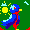

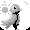

I then got Co-Pilot to create a system where the code would pick a random reference image, scale it to match the number of squares in the canvas, and then posterize it to simplify it into only a few contrasting colours. From this, I had each generation generate a "Colour Pallette" which consisted of 5 randomly generated colours. Each of these colours would then be associated with one of the image's unique, posterized colours. 
Then I got Co-Pilot to make a new rule:
6. There is a 80% chance that a square will be coloured with their reference colour, which is the colour palette colour associated with that specific square. This rule will take priority except for the completely random rule.

This meant the images could use the structure of a reference image to create a recognisable image.
To further test this, I downloaded some large royalty-free images of birds to test its ability to convert them into a usable reference, which can be seen in: 

 

I also made some adjustable variables to change the size of the canvas, which would also change how the images were scaled down.
I also made past generation save and display at the top of the screen so I could see the changes in the progress.

These features can be seen with the first commit and in: 

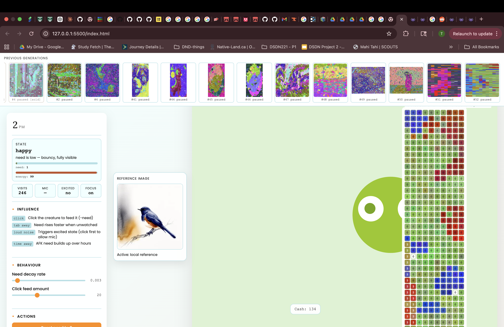

### UI Changes / User Input

Next, I wanted to make the site a bit cleaner and easier to navigate, so I first removed the sidebar with all the parts I didn't need. Replacing the need bar with a new Hunger Bar and an Energy Bar, I made while learning about the template code. Next, I was inspired by a game jam project I had made earlier in the trimester, so I wanted to make the Canvas Grid a draggable element in the scene to let users more easily organise the site to their liking.

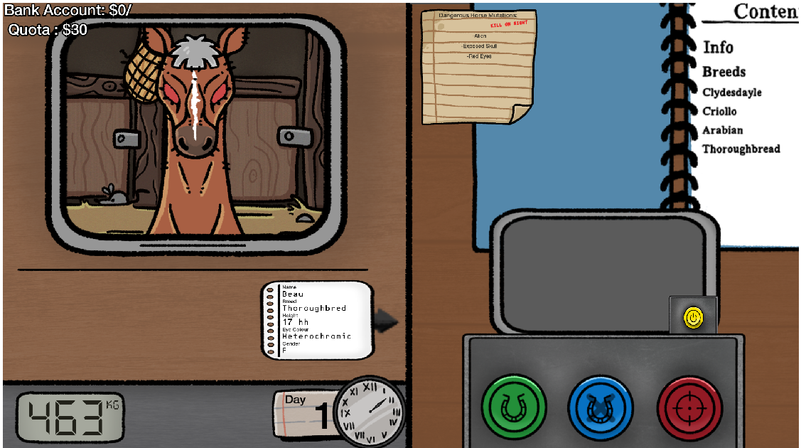

I also decided to give the user more control over the art by giving them the ability to freeze some colours in the palette if they wanted to make generations with a limited palette, and a paintbrush, so they could also draw on the painting if they wanted to influence the generation. 

### Improving User Input
After this, I wanted to give the user even more control, so I made a series of variables that would decide the style and colours of the image. This was done through some buttons called "I Like this Generation" and "I Dislike this Generation," which would help fine-tune the generation's style for the user by either trying to create generations with similar variables and colours to the current generation project when liked, or to choose something completely different when disliked. I intended to use this minimal system to make the generation feel like it was making more natural changes; however, this broad system became very frustrating when trying to push the generations to a specific style.

The solution for this was to split it into more specific buttons. From this I made the "More Precise" and "More Abstract" button which influence the chance of the squares following the reference rule, and later, whether the 5% compeltely random rule would even be applied, and the "Noisier" and "Cleaner" button which controls the limits a colour could go from it's chosen colour, which so happened to be great for create coloured Noise.

### Reference Image Search
The next change I made was the ability to pick your own reference images, as limiting the number of reference images to what could be stored in the repository made the generations feel repetitive. So, for this, I got Co-Pilot to make an image search system that would take in a text input and use its keywords to find a pool of images on OpenVerse, a royalty-free image database with millions of images. From this pool, it would then pick the images with the most contrast and randomly pick from them. This image would then go through the same resizing and posterizing system to make it a new reference image.

This meant that users could try to generate an image of practically anything, which greatly expanded the types of images they could generate. For example: 

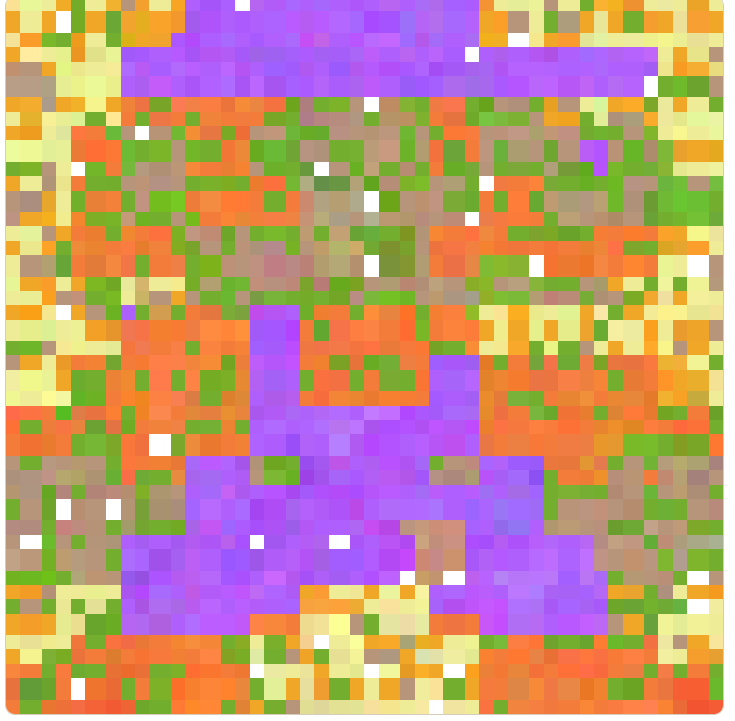

### Selling Paintings
While I was working on this, I noticed that the past generations tab was filled with random, incomplete test generations since there was no way to clear them. So I added a mechanic where you could sell past-generation paintings for money. Though I didn't want this to just be a flat money gain, so I got Co-Pilot to make a system which will randomly pick from a list of buyers, each of whom would have their own taste in art, with the user being paid more depending on how close their generation settings matched the buyer's taste. These buyers would be randomly chosen from when sold to encourage the user to make generations with a variety of styles.

### Buying Upgrades and Food
However, this money was currently useless as there was nothing to buy, so I got Claude to code a shop menu where the user could buy food to feed the creature and upgrades to improve the generations, like more colour palette slots, bigger canvases, and the search button, which now needed to be brought to bring a sense of progression.

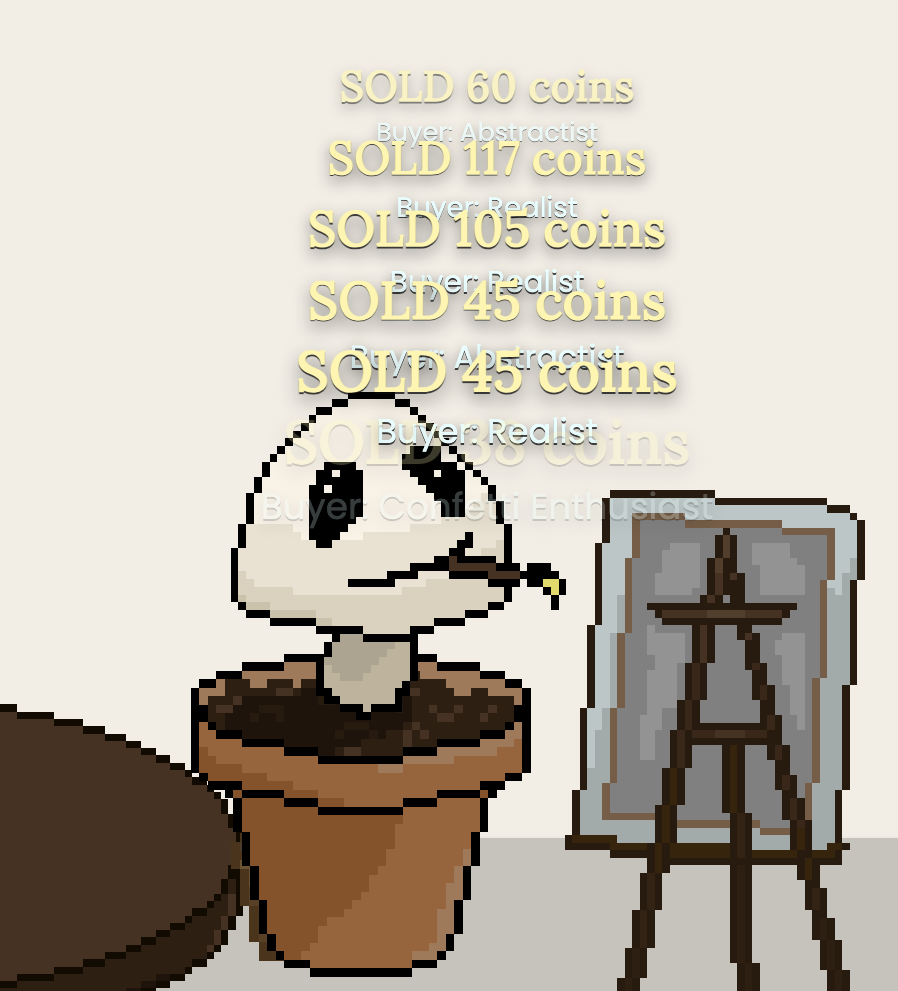

### Improved Interaction UI
Next, I worked on further improving the UI. The biggest problem I had was the disconnect between the generation and the creature, with all the options just being disconnected buttons. For this, I was recommended in class to use a radial menu system for all the settings, so that's what I did.
I wasn't too sure how to code a menu like this, so I drew up some example images:

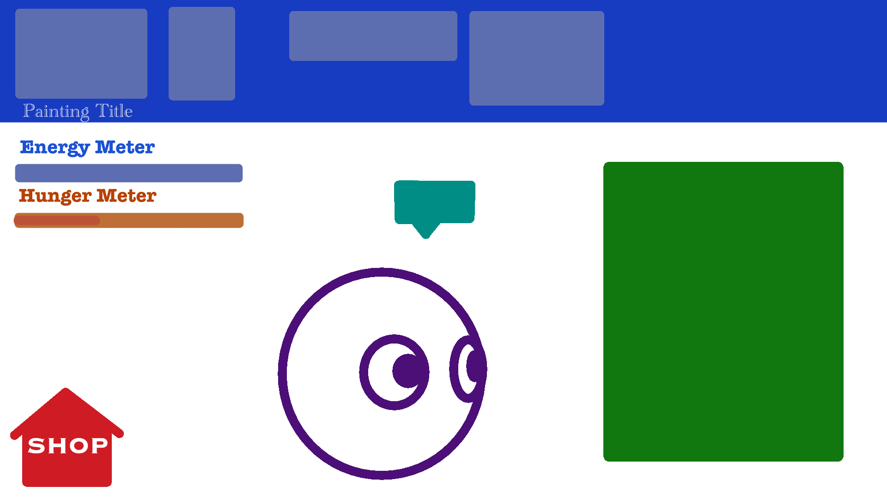
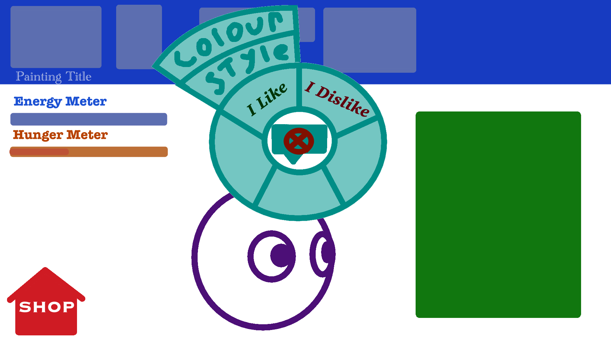

I asked both the co-pilot and Claude to try to recreate. Eventually, after a lot of attempts and iterations, I was finally able to make it work, which I'm pretty proud of, as the radial menu makes interacting with the creature feel more like communication than just pressing buttons.

### Letting the Familiar Rest
I also added a resting mechanic as the only way to get back energy by sleeping. This helped limit the number of generations made, but I didn't really like just stopping the generation until the familiar rests. So I decided to make something a bit more punishing for trying to make the creature continue working when exhausted, so I made every new user generate an "easy style", a randomly generated style that represents the style the creature can do without much effort. As the creature gets more tired his art will start to drift back to this easier style as they run out of energy, meaning the style you set for a generation can completely change while it's being made, resulting in something unwanted and taking control away from users.
Later, I added more to this resting mechanic, like its own animation, and the ability to wake the creature up early by tapping it awake or shouting at it.

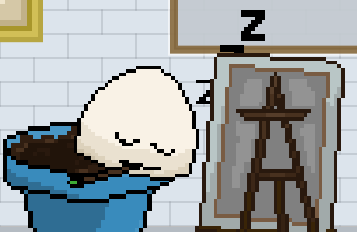

### Dialogue System
Although I had a working generation system, I thought it still lacked the Familiar aspects, so I wanted to add more character to the familiar on the site. To do this, I went back to my initial idea and decided to add text boxes so the family could talk. For this, I also wanted to add some portrait art to make the family more expressive.

### The Creation of the Mushroom Familiar
The design of the familiar was a mix between this little mushroom character I got in a Gashapon last year:

 
And a 3D model of a soldier being controlled by a mushroom I made last year: 

This was because I wanted to make a unique and cute character that would be struggling with painting. So I thought if I made a plant with no arms would fit that. I also made some more art for the canvas, search button, and an animated sprite for the familiar. Putting all of this together made the website feel a lot more like a Tamagotchi with its own world it can interact with.

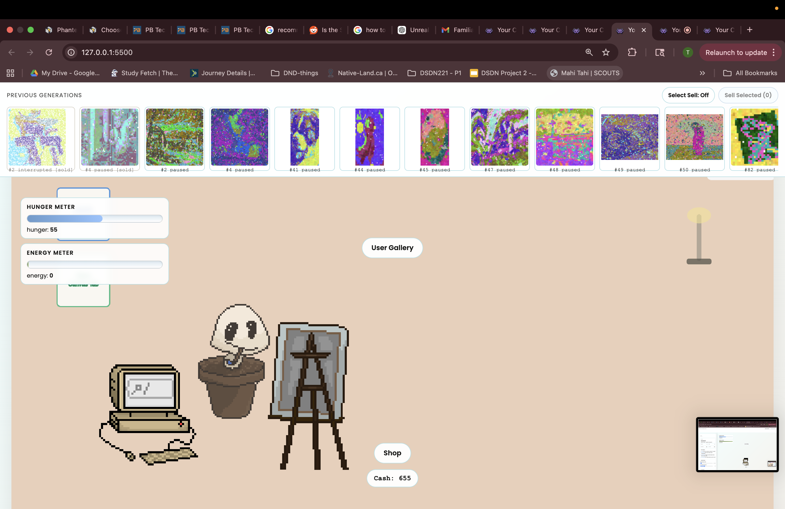

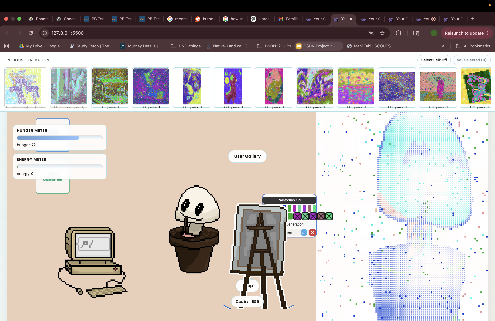

### Making Gallery Page
However, with these new elements, I found it was getting really hard to see the past generations, so I decided to make a new page connected to the main site purely to be able to view your past works. For this, I got Co-Pilott to make a new site which will display all the currently owned paintings as framed works on a gallery wall, making them into actual image files so they can be downloaded, and even letting the user set a favourite painting which proudly displays at the top of the site.
To fix the barrenness of this site, I got Claude to write some code that will give the painting a random name depending on its style and subject matter.

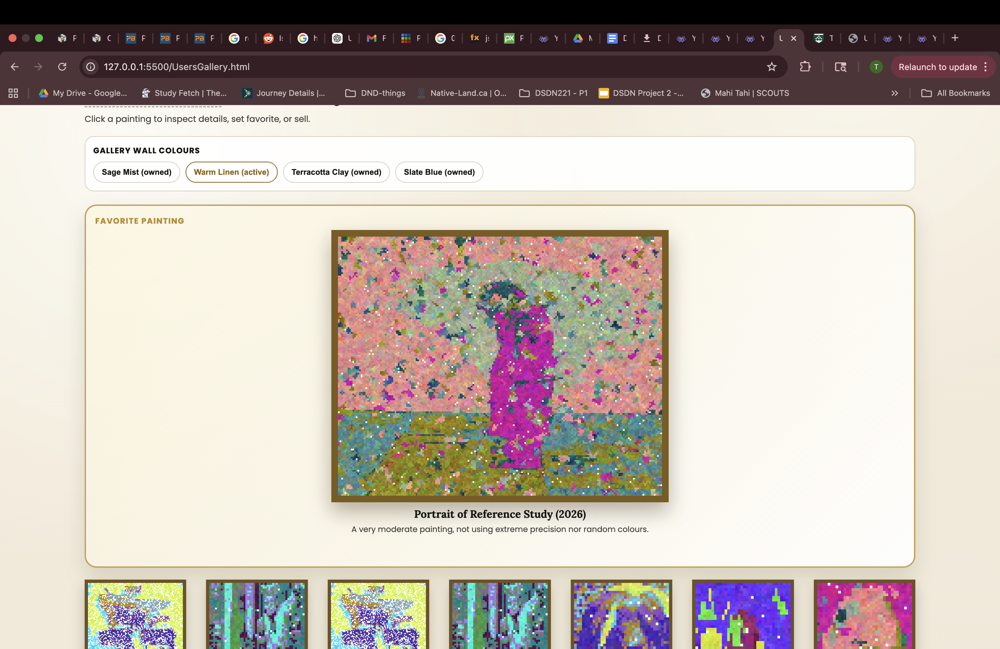

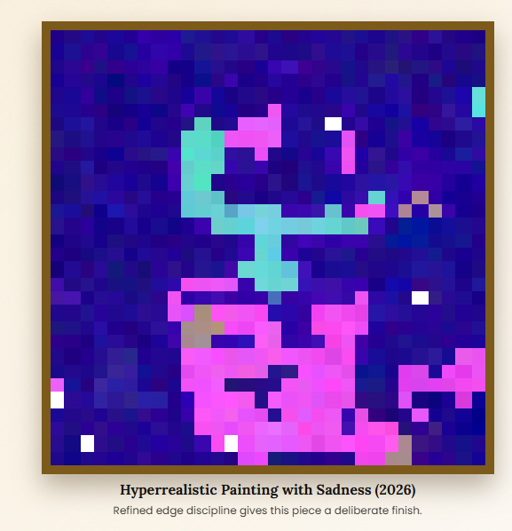

### Adding a World Space and Improving Store
Now that I had a place to properly display the images, I made the past generation tab even smaller to make space for more elements in the Familiars' world. First of I got Co-Pilot to add some P5 backgrounds and floor to the "studio" and Gallery scenes, which could be brought into the store (a decision I would later regret as it caused one of the most annoying bugs). I also redesigned the store to be more segmented with colours, so it was clearer to see what you were buying.

### Food 2.0 / Studio Decorating
I'd been seeing a lot of videos online about Tomodachi Life: Living the Dream at this time, so I wanted to make a system where you give gifts and food to the creature. For this,s I quickly drew out some food sprites and decoration sprites in a couple of lectures: 

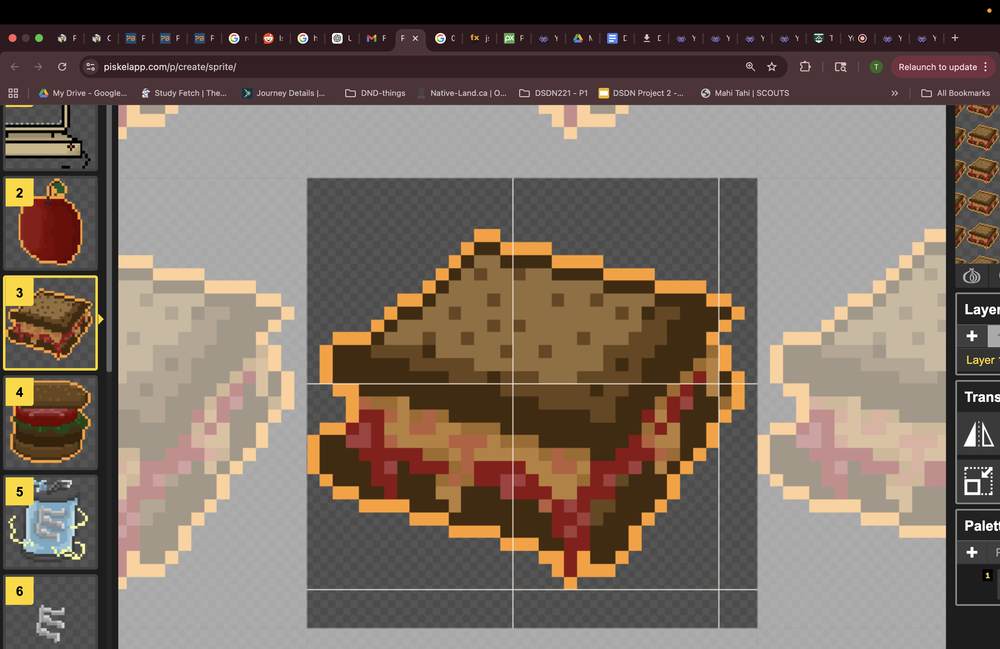 

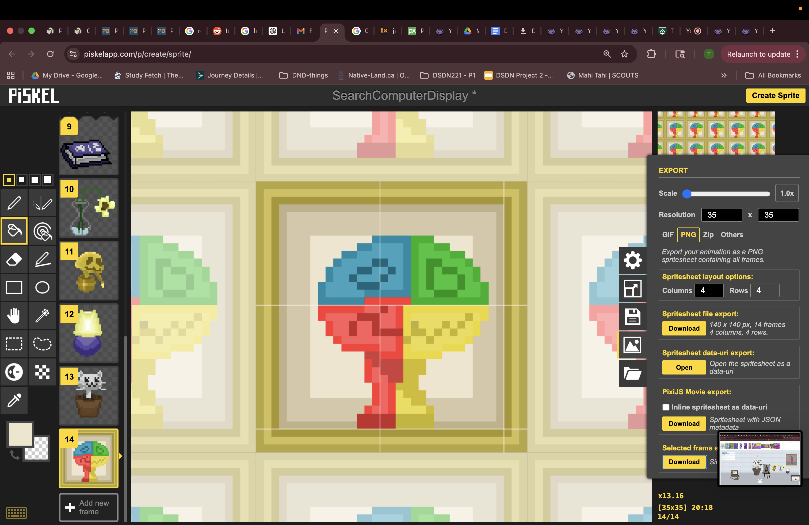 

And then got Co-Pilot to add them to the store, and to make the food sprites appear in the scene when brought where they could be dragged around and dropped, using extremely simple physics, to be fed to the mushroom. I also added a way to more easily get energy with the energy drink; however, for the cost, just making it increase energy felt a bit like a rip-off. So I instead made it temporarily speed up the generation until energy reached 50%, also increasing the energy decrease speed to help balance it a bit. 

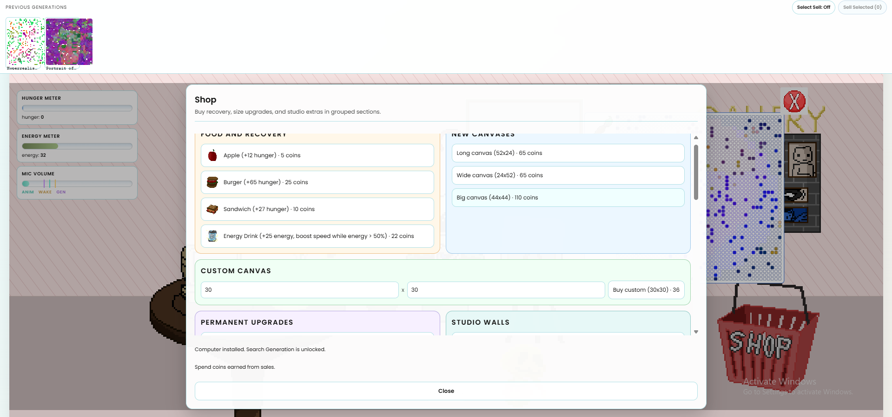 

There was one decoration I didn't draw, though, and that's the "Favourite Painting," which I got co-pilot to make in p5 so the user could see their favourite past painting in the studio. 

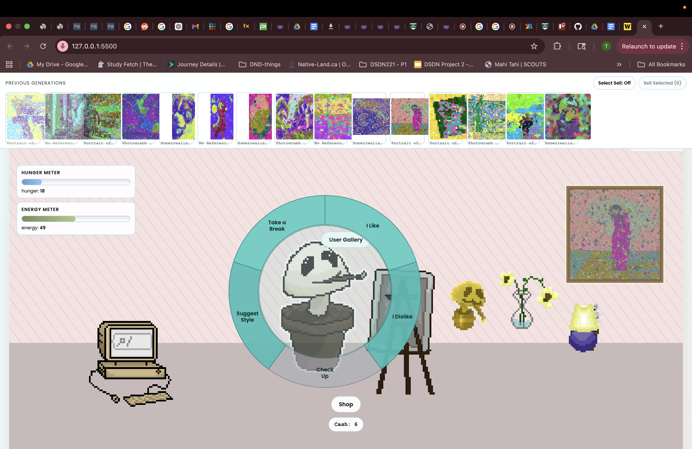

### Sound Design
After this,s I wanted to further improve the immersion of the site with sound design,gn so I went to a couple of places to get royalty-free sound and music for purchasing and renovating, then I found an 8-bit sound maker called sfxr, which I used to make the dialogue blip, eating noises, shaking noises, and sound effects. I then got Co-Pilot to implement them with variables to adjust their volume. I also added some purchasable classical background music, which I used, a royalty-free song "Classical Music (Theater Museum Art Painting Sculpture Background)" by BackgroundMusicForVideos.

### Improving UI Again
To further contribute to the style, I made the Gallery and Shop buttons sprites made in a pixel art style, which (like with all the pixel art in this project) I made in Piskel. I also correctly positioned and scaled the decorations, as well as adding a table purely to have more spaces to put decorations on (because having everything on the floor is very unprofessional).

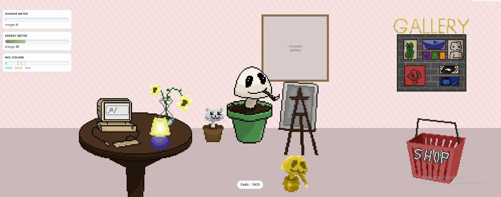

### Making Tutorial Book and New Player Menu
After getting some more feedback, my tutor suggested a tutorial system for new users to show how to use all the game mechanics.
For this, I decided to make a guide book the player flips through the pages of, similar to the guidebook page from my Design Website. Though like that one, I wanted to make it a more diegetic thing with a diachronic reason for existing.
So I decided to make it a Theoretical Scientific Paper written by Dr. Duxelles (a French dish of mushroom mince) called How to Teach Paint to a Mushroom.
This also gave me an excuse to add some story to the familiar and the reason for the player to teach the familiar to paint, with the book stating that if someone were to teach this hypothetical mushroom painting and creativity, it could make them millions from the research.

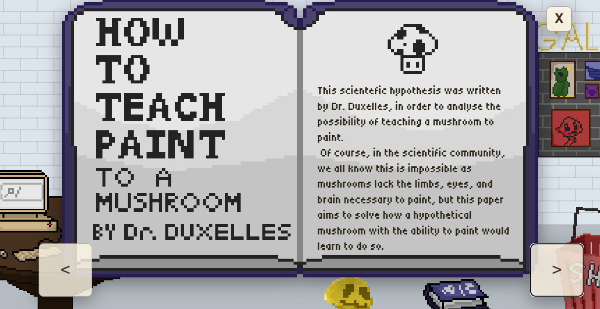

I also decided to make the mushroom seen in the book distinctively different from the familiar, as I wanted to make it seem like the familiar is a one-of-a-kind, mutated mushroom with all the requirements to paint. 

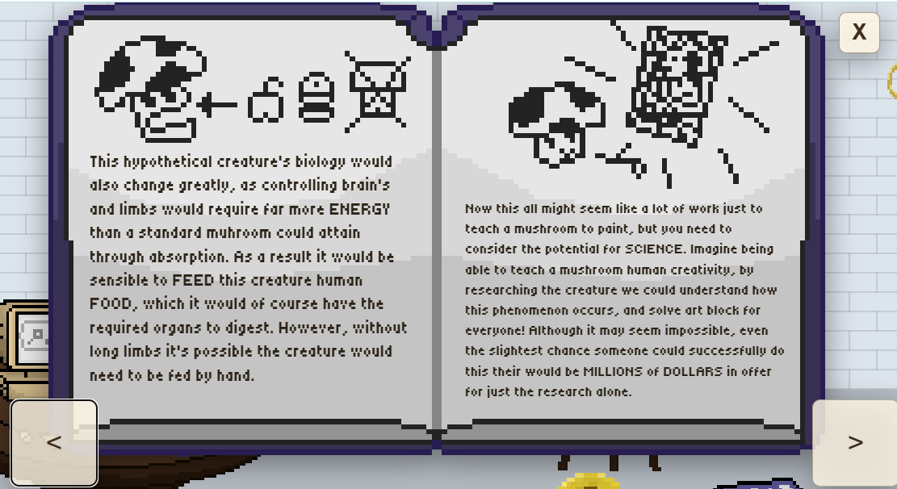

As for how I made it, I got Claude to make a pop-up screen that would appear when a new user opens the website, which was actually intended to fix a weird bug where, in one of the deployments, a new user could start with a random amount of money and some corrupted past paintings. This pop-up asked if the user had played before, with replying no, deleting any accidental already existing progression, before opening the pop-up tab for the book. This tab was made very similarly to the canvas tab, having a draggable area, two text boxes, and buttons to navigate the book. I also later added this book to the scene, so returning players could also check how to play. 

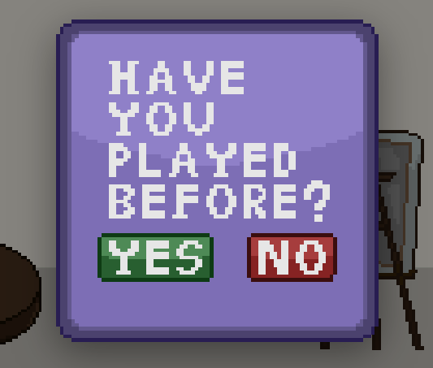

### Adding Questions
Next, I wanted to further the creature interactions by making it seem more alive, so I gave it the ability to occasionally stop and ask the user a question about their style. To do this, I simply paused the generation and made a question mark appear above the creature's head, then I got Co-Pilot to make 1 of 3 possible question dialogue boxes, which would gray out some of the user's possible input so they could answer the creature. 

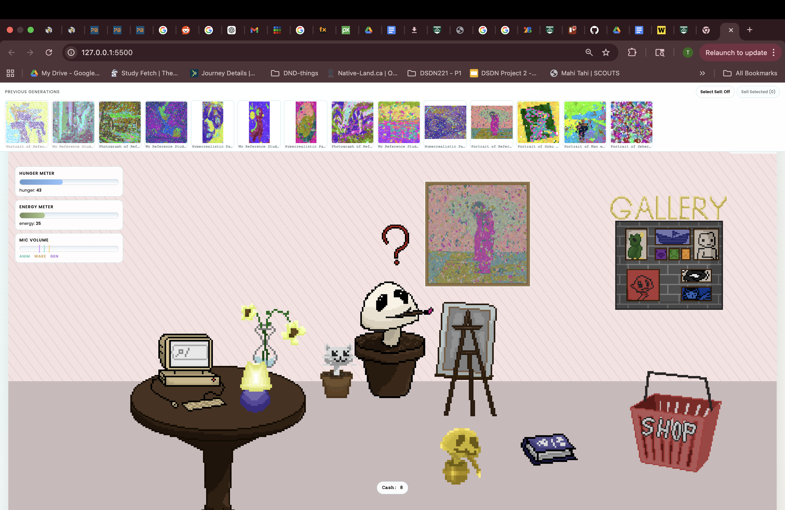

### Scrapped Confidence Mechanic
I had planned to make this go along with a confidence system, which would make the creature ask fewer questions and appear more confident if they continued to receive positive feedback, or ask more questions and appear more nervous when they've received a lot of negative feedback.
Actually, in my original planning, I wanted to use this confidence system as well as the energy system to make the creature go between multiple states. This system would work similarly with the more nervous state, asking more questions and being more influenced by feedback, while the confident state has the possibility to completely ignore user feedback. These two states would even be pushed to the extremes when the creatures energy was low, with a Confident Tired state acting more insane, completely ignoring inputs, refusing to sell paintings and even stopping the player from making progress resets, and a Nervous Tired state acting more depressed, asking for a lot of input, having the ability to destory their paintings that they didn't like, and even being able to do a progress reset. However, when I was making the character design, I realised that this system didn't really match the lighthearted tone of the site.

### AFK Generation
Since I wanted it to feel like the familiar was still improving while the user wasn't looking at it, I got Co-Pilot to check the amount of time the player is away from the website or the website is closed, and then quickly generate a couple of paintings for every hour the user was away. Originally, this came with some bugs where they would just create this same greenish noise, but after some troubleshooting, it is able to generate some paintings without any user input, trying to use the style and colour pallettes they had last been praised for by picking from a random set of saved style parameters.

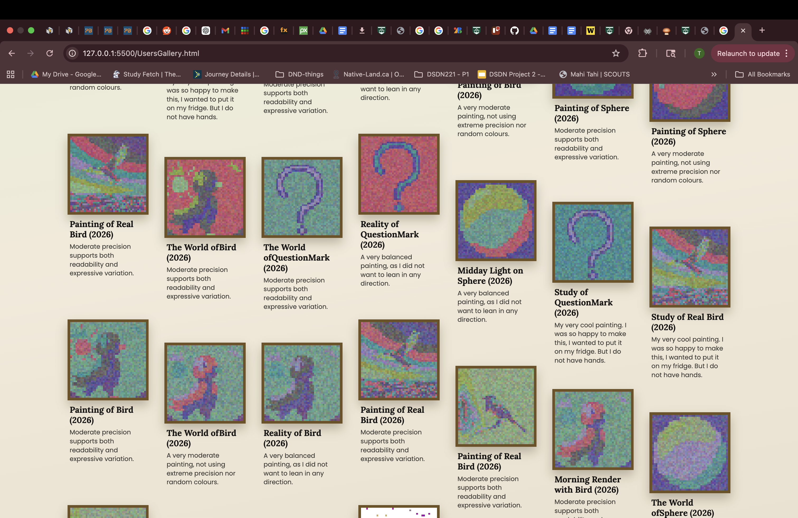

### Improving the Pot
Currently, the pot and mushroom were just one sprite, and since it was using a modified version of the Templates creature, the sprite would bounce, grow, or shrink, making the pot look like it's floating around. So I split the sprite into the stationary pot and the moving and animating mushroom, which also meant I could add some character customisation by simply selling recoloured pots in the store.

### Microphone Inputs
The final feature I added was microphone support. This was because I noticed I still hadn't removed the microphone checking feature from the original template. Though, since it was already implemented, I thought it would be fun to implement some secret microphone controls to give the player even more immersive input. This uses a pretty simple system, checking how much volume the microphone is getting and from that changing some variables. The two ways the mic input can affect the familiar currently are waking it up instantly if it receives a loud noise when sleeping, and also a generation and animation speed increase if it gets a sustained loud noise while generating, letting the user either encourage it or yell at it for not working fast enough.

## Considerable Bugs and Glitches
### Radial Menu
Throughout this project, there were also a bunch of bugs that I had to fix, although some of them weren't too difficult to fix. There were a few annoying bugs that either took hours to fix or I ran out of time to fix.
The first large batch of bugs and problems came from the implementation of the radial menu. As I'd never made a menu like it before, I asked co-pilot to code it in. Though it seemed to really struggle with the concept of a radial menu, starting with just making them a stack of buttons, then just randomly positioning them around the screen, making the buttons into strange shapes, and making the multiple layers of the ring connect to incorrect buttons and positions. Even when making a reference image and asking other AIs like Claude, the radial menu still wasn't working until many hours into making it, when it finally came together.

### Layering
The next major bug came from the canvas button and canvas tab, where no matter how I tried layering the two elements, the canvas button would always appear in front of the canvas tab. Though since other, more pressing bugs were crashing or soft-locking the site, and that only two elements were actually being affected, I pushed this bug to the side until later in development, in which it took many hours of reading code, changing z-index variables, and making new systems to make them layer correctly until I found a system that properly layered them. With one problem, the canvas would just disappear. After even more time, I figured this was because the two p5.js elements, the canvas tab and the backgroun where using the same z-index. So I kept trying to separate their z-index for more hours, before realising I could just make them two different canvases, so they wouldn't share a layer.

### File Corruption and Crashing
Lastly, throughout their were many problems with saved files corrupting, the site struggling to load, and many things freezing. These were all generally fixed by co-pilot and Claude as they appeared pretty late into development when I had to work on other things, and this is why I added things like a loading screen and made the code completely erase all traces of sold paintings to not fill the websites' locally saved data with inaccessible images.

### Read Me / Bonus Planning
I then finalised my Read Me, sorting it into more organised segments and adding images to areas that didn't currently have any. 

I also at the end added some debug keys to fully show the project and all it's mechanics so:

Pressing the M key will instantly earn you $100 to test the shop
Pressing the S key will reload the page, skipping forward one hour so you can see how the AFK Generations work.

Also I would recommend using this on a larger moniter as the current laptop version can hide some things like the Mushroom Cat.

I also found some planning notes I had written down for features I unfortunately didn't, so I added them at the end as a little bonus:

        Add an image search system that pulls an image from the internet and tries to match the tone or a difference of the colours of said image, hopefully create a recognisable shape.

        A praise button which makes it save it's colour pallette and save a reference of the painting which it will then refer to, making the colour pallette more in range of what was considered good and trying to keep to the same use of different colours in places.

        A hate button which does the opposite.

        A manic meter which increases the more time the creature draws, with it going down once they take a break (30% chance to stop for a short amount of time after painting around 50 squares), or if the user lets them take a break when they ask (once the manic meter reaches between 70 - 80 %)

        If this manic meter reaches 90-100% their art will become more bizarre, changing its reference images mid drawing and having higher chances of introducing new colours and breaking rules.

        An ability to talk to the ai prompting it with the google search it will use as reference (picks from first 5 images WITH SAFE SEARCH ON).

        The creatures dialogue (when asking questions or just passive dialogue while working) will change between different modes depending on it's manic meter and it's confidence meter (confidence meter goes up when it i praised making it ask less questions and be more proud of it's work)

        Low confidence, low manic - Nervous artist, asks questions and sticks heavily to the rules.

        Low confidence, high manic - Scared artist who asks way too many times and prioritises using white to remove their work as they don't like it

        High confidence, low manic - Becomes very arrogant, believing their work is good and giving them the ability to break rules as it knows best.

        High confidence, high manic - Gains a god-complex ignoring all the players advice and doing whatever it wants, here it can also refuse to start a new painting when the player presses the start again button, since it wants to keep working on the last one.

        Creature reset switch. If the creature gets a little to out of control or the user wants it to stop doing what it was praised for they can use the very humane creature reset switch which resets it's confidence and manic to nuetral and wipes all it's reference and memories by hitting it in the head with a baseball bat.

        Of course if it has high manic and high confidence it can take the baseball bat and throw it away, becoming completely uncontrolled, and if it has high manic and low confidence it can choose to pick up the bat and hit itself to reset it.

        Other than breaks, you can also get the manic meter down by feeding the creature food which can be brought using coins from a shop. However in order to get coins, you must permanently delete a painting from you gallery to sell it, with it's value being based on how praised the art was and other factors like consistency, accuracy to reference, and use of colours. But the value will generally be random.

        When website is first open the creature gets a art preference which sets all the value to a random amount, when they get more tired these values start to drift more towards their preferences.

        But first, fix UI to work with a visual novel text system where you press a talk Icon above the creature where you can give it advice and ideas for references, or even just talk to it.

        Then make the art for the creature with some simple frames for -
        Painting
        Resting
        Sleeping
        Thinking
        Talking
        Sad
        Angry
        Happy
        Proud
        Determined

        Then try and add AI chatbot functions allowing the NPC to talk freely and also recieve advice if what the player writes to it fits within one of it's functions.

        Then add things like hunger and energy meters as well as a shop so you can buy it things like new canvases, more color pallette slots, food, and coffee (which boosts the draw speed and increases energy though it can quickly diminish)

        You may also be able to buy things like decorations in the room around the creature, including one which puts a random painting which best matches the creatures preferred style the most from the saved paintings. Selling this one will instantly make the creature sad.

        Add an AFK mode where the creature will continue making pieces at a much slower rate based on the style and colour of the past liked paintings.

        Add themes of AI art, where the creature has lost it's job due to being sued for just copying other artists exactly and wants help developing an actual individual art style through hard work and practice, however it is still never able to make anything truly original.

        Make the canvas detached so the user can move it around freely and so it only appears when the canvas is clicked.
        Also make it so aswell as the preview the user can also go to a gallery where all the paintings are displayed on a wall, and can be sold.

        Things to add Before Submission:
            - Remove free money.

            - Fix bugs

            - Write over new text box text to make them better.

            - Make the shop menu more like a catalogue with sprite art to match the style of the site.
            - Add confidence meter which will cause the creature to ask more or less questions, and will effect the general mood of the text.
            - Add more animation to the creature for eating, multiple painting, questioning.

            - Add more music or sound design.
            - Add more portraits

            - Add end of game painting, by buying the grand painting which causes the mushroom to ask for the style and colour, but not the reference, as it generates a detailed self-portrait which becomes their magnum opus. Ending the game with a credits roll, where, although you can keep generating the Magnum opus will still appear in the studio and gallery.

Everything Breaks : Bugs and Layering problems

Read eM

Free DLC bonuses

New Smash Bros Fighter Announced?

Make the suggestions effect the current generation as well as the next one.
Fix problem where using past generations colour pallette would delete the upgrade, make them instead freeze any pallette which wasn't in the previous generation.
And there is a problem where freezing a large amount of colours will make only noise as instead of just simplifying the pallette it will just use blank areas as random colours.
It is also just generally make staticy colours which don't properly match the offset variables and the precision.

Make things appear in place no matter the size of screen.
Fix afk generation to occur whenever the website is closed and to work faster.
Split the background and canvas tab to be two different canvases so they can be at different z-indexes.
Make a button that instantly gives $100 for debugging.
Add more reference images from the repository folder.